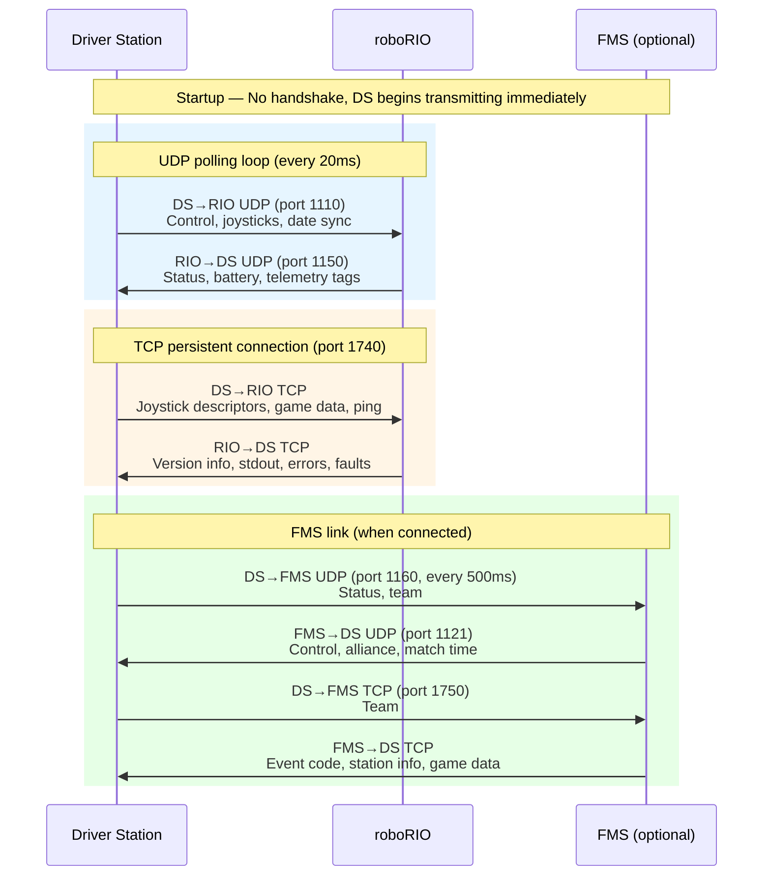
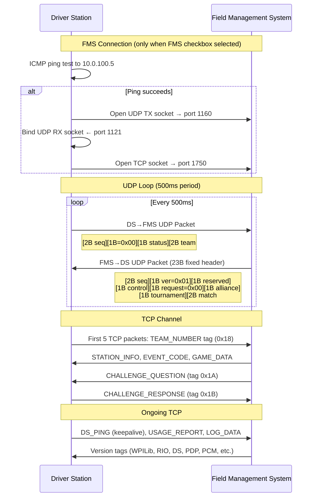

# FRC Driver Station Protocol Specification

> **Source of truth**: This document is derived from the OpenDS.ai implementation (protocol years 2014–2026).
> All byte offsets, flag values, and behaviors reference the Java source directly.

---

## Table of Contents

1. [Executive Overview](#executive-overview)
2. [Network Topology & Ports](#network-topology--ports)
3. [Connection Lifecycle](#connection-lifecycle)
4. [DS ↔ RIO Protocol (Detailed)](#ds--rio-protocol-detailed)
5. [DS ↔ FMS Protocol (Detailed)](#ds--fms-protocol-detailed)
6. [Tagged Payload System](#tagged-payload-system)
7. [Control, Status & Flag Bytes](#control-status--flag-bytes)
8. [Sequence Counters](#sequence-counters)
9. [Date Synchronization](#date-synchronization)
10. [Protocol Versioning](#protocol-versioning)
11. [Tag Reference Tables](#tag-reference-tables)
12. [Appendix: 2014 Legacy Protocol](#appendix-2014-legacy-protocol)

---

## Executive Overview

The FRC Driver Station protocol is a **connectionless, polled** communication system between three possible participants:

| Participant | Role |
|---|---|
| **Driver Station (DS)** | Sends control commands, joystick data; receives telemetry |
| **roboRIO (RIO)** | Receives commands; reports status, diagnostics, console output |
| **Field Management System (FMS)** | Optional; overrides control authority during competition matches |

**Key characteristics:**
- **No handshake** — the DS begins transmitting as soon as it can reach the RIO
- **Dual-transport** — UDP for real-time control/status, TCP for metadata and diagnostics
- **Tag-based extensibility** — variable-length tagged payloads within both UDP and TCP packets
- **Version-aware** — protocol year (2014–2026) determines flag values and packet structure



---

## Network Topology & Ports

### Address Resolution

The DS resolves the RIO address using one of these strategies:

| Method | Address | Condition |
|---|---|---|
| USB direct | `172.22.11.2` | USB checkbox selected |
| mDNS hostname | `roboRIO-{TEAM}-FRC.local` | Team number entered (years > 2015) |
| mDNS hostname (legacy) | `roboRIO-{TEAM}.local` | Team number entered (years ≤ 2015) |
| Manual IPv4 | User-entered IP | Input matches IPv4 regex |
| Localhost | `127.0.0.1` | Input is "localhost" |

> **Source**: [`AddressConstants.getRioAddress()`](../src/main/java/com/boomaa/opends/networking/AddressConstants.java#L37-L52)

The FMS address is hardcoded to `10.0.100.5`.

> **Source**: [`AddressConstants.FMS_IP`](../src/main/java/com/boomaa/opends/networking/AddressConstants.java#L8)

### Port Assignments (2020–2026)

| Remote | UDP TX (DS sends) | UDP RX (DS receives) | TCP | Shuffleboard |
|---|---|---|---|---|
| **roboRIO** | 1110 | 1150 | 1740 | 1735 |
| **FMS** | 1160 | 1121 | 1750 | — |

> **Source**: [`AddressConstants`](../src/main/java/com/boomaa/opends/networking/AddressConstants.java#L10-L11) — `RIO_PORTS_2020 = PortQuad(1740, 1110, 1150, 1735)`, `FMS_PORTS_2020 = PortTriple(1750, 1160, 1121)`

### Timing

| Clock | Remote | Protocol | Interval |
|---|---|---|---|
| `RIO_UDP_CLOCK` | roboRIO | UDP | **20 ms** |
| `RIO_TCP_CLOCK` | roboRIO | TCP | **20 ms** |
| `FMS_UDP_CLOCK` | FMS | UDP | **500 ms** |
| `FMS_TCP_CLOCK` | FMS | TCP | **500 ms** |

> **Source**: [`NetworkClock` constructor](../src/main/java/com/boomaa/opends/networking/NetworkClock.java#L21) — `super(createName(...), remote == Remote.ROBO_RIO ? 20 : 500)`

### Socket Configuration

| Transport | Setting | Value | Source |
|---|---|---|---|
| UDP | TX/RX timeout | 2000 ms | [`UDPInterface` constructor](../src/main/java/com/boomaa/opends/networking/UDPInterface.java#L20) |
| UDP | RX buffer | 1024 bytes | [`UDPInterface.bufSize`](../src/main/java/com/boomaa/opends/networking/UDPInterface.java#L17) |
| TCP | `TcpNoDelay` | `true` | [`TCPInterface` constructor](../src/main/java/com/boomaa/opends/networking/TCPInterface.java#L25) |
| TCP | SO timeout | 1000 ms | [`TCPInterface` constructor](../src/main/java/com/boomaa/opends/networking/TCPInterface.java#L31) |

---

## Connection Lifecycle

There is **no application-level handshake**. The DS establishes connectivity by:

1. **Ping test**: ICMP reachability check with a 1-second timeout
2. **Socket creation**: On success, UDP + TCP sockets are opened to the resolved address
3. **Immediate transmission**: The `NetworkClock` scheduler begins sending packets on the first cycle

> **Source**: [`NetworkClock.reloadInterface()`](../src/main/java/com/boomaa/opends/networking/NetworkClock.java#L73-L102)

If the ping fails or a socket error occurs, the DS disables the enable button and retries on the next clock cycle. On any write failure, the interface is closed and fully reloaded.

```mermaid
sequenceDiagram
    participant DS as Driver Station
    participant RIO as roboRIO

    Note over DS,RIO: Connection Establishment (no handshake)
    DS->>DS: ICMP ping test to RIO address
    Note right of DS: Address resolution:<br/>USB: 172.22.11.2<br/>mDNS: roboRIO-TEAM-FRC.local<br/>Manual IPv4 / localhost

    alt Ping succeeds
        DS->>RIO: Open UDP TX socket → port 1110
        DS->>DS: Bind UDP RX socket ← port 1150
        DS->>RIO: Open TCP socket → port 1740
        Note over DS,RIO: All four clocks start immediately
    else Ping fails
        DS->>DS: Disable enable button, retry on next cycle
    end

    Note over DS,RIO: Steady-State UDP Loop (20ms period)

    loop Every 20ms cycle
        DS->>RIO: DS→RIO UDP Packet
        Note right of DS: [2B seq][1B ver=0x01][1B control][1B request][1B alliance]<br/>+ tagged payloads (DATE, TZ for first 10 pkts; JOYSTICK when enabled)

        RIO->>DS: RIO→DS UDP Packet
        Note left of RIO: [2B seq][1B ver=0x01][1B status][1B trace]<br/>[2B battery][1B dateReq]<br/>+ tagged payloads (JOYSTICK_OUT, CPU, DISK, RAM, PDP, CAN)
    end

    Note over DS,RIO: TCP Channel (persistent, TcpNoDelay)

    loop Each TCP cycle
        DS->>RIO: DS→RIO TCP Payload
        Note right of DS: Tagged payloads only (no header):<br/>JOYSTICK_DESC × 6, GAME_DATA, MATCH_INFO, DS_PING

        RIO->>DS: RIO→DS TCP Payload
        Note left of RIO: Tagged payloads only:<br/>VERSION_INFO, USAGE_REPORT, ERROR_MSG,<br/>STANDARD_OUT, RADIO_EVENTS, DISABLE_FAULTS, RAIL_FAULTS
    end

    Note over DS,RIO: Date Synchronization (first 10 UDP packets)
    DS->>RIO: UDP packets 1-10 include DATE + TIMEZONE tags
    RIO->>DS: dateRequest byte = 0x01 until sync complete
    DS->>RIO: After 10 packets, DATE/TZ tags no longer sent
```

---

## DS ↔ RIO Protocol (Detailed)

### DS → RIO UDP Packet

> **Source**: [`Creator2020to2026.dsToRioUdp()`](../src/main/java/com/boomaa/opends/data/send/creator/Creator2020to2026.java#L21-L53)

**Fixed header (6 bytes):**

| Offset | Size | Field | Description |
|---|---|---|---|
| 0 | 2 | `sequenceNum` | Monotonically increasing, increments by 2 each packet |
| 2 | 1 | `commVersion` | Always `0x01` |
| 3 | 1 | `control` | Bitfield: E-Stop, FMS connected, enabled, mode |
| 4 | 1 | `request` | Bitfield: DS connected, reboot RIO, restart code |
| 5 | 1 | `allianceStation` | 0–2 = Red 1–3; 3–5 = Blue 1–3 |

**Variable tagged payloads follow the header.** Content depends on state:

| Condition | Tags included |
|---|---|
| Sequence counter ≤ 10 | `DATE` (0x0F), `TIMEZONE` (0x10) |
| Robot enabled | `JOYSTICK` (0x0C) × one per active joystick index |

### RIO → DS UDP Packet

> **Source**: [`Parser2020to2026.RioToDsUdp`](../src/main/java/com/boomaa/opends/data/receive/parser/Parser2020to2026.java#L16-L44)

**Fixed header (8 bytes):**

| Offset | Size | Field | Description |
|---|---|---|---|
| 0 | 2 | `sequenceNum` | RIO's sequence counter |
| 2 | 1 | `commVersion` | Always `0x01` |
| 3 | 1 | `status` | Bitfield: E-Stop, brownout, code init, enabled, mode |
| 4 | 1 | `trace` | Bitfield: robot code, isRoboRIO, mode flags |
| 5 | 1 | `batteryInt` | Battery voltage integer part |
| 6 | 1 | `batteryFrac` | Battery voltage = `int + frac/256` |
| 7 | 1 | `requestingDate` | `0x01` if RIO needs date sync, `0x00` otherwise |

**Tagged payloads** (variable, starting at offset 8):
`JOYSTICK_OUTPUT`, `DISK_INFO`, `CPU_INFO`, `RAM_INFO`, `PDP_LOG`, `CAN_METRICS`, etc.

### DS → RIO TCP Payload

> **Source**: [`Creator2020to2026.dsToRioTcp()`](../src/main/java/com/boomaa/opends/data/send/creator/Creator2020to2026.java#L55-L65)

**No fixed header.** The payload is a concatenation of tagged payloads:

| Tag | Count | Condition |
|---|---|---|
| `JOYSTICK_DESC` (0x02) | × MAX_JS_NUM (6) | Always |
| `MATCH_INFO` (0x07) | × 1 | When FMS connected |
| `GAME_DATA` (0x0E) | × 1 | Always |
| `DS_PING` (0x1D) | × 1 | Always (empty keepalive) |

### RIO → DS TCP Payload

> **Source**: [`Parser2020to2026.RioToDsTcp`](../src/main/java/com/boomaa/opends/data/receive/parser/Parser2020to2026.java#L46-L53)

**No fixed header.** Concatenated tagged payloads with 2-byte big-endian size prefixes.

---

## DS ↔ FMS Protocol (Detailed)



### DS → FMS UDP Packet

> **Source**: [`Creator2020to2026.dsToFmsUdp()`](../src/main/java/com/boomaa/opends/data/send/creator/Creator2020to2026.java#L67-L104)

| Offset | Size | Field | Description |
|---|---|---|---|
| 0 | 2 | `sequenceNum` | FMS-specific counter |
| 2 | 1 | (reserved) | Always `0x00` |
| 3 | 1 | `status` | Combined E-Stop + robot connection + RIO connection + enabled + mode |
| 4 | 2 | `teamNumber` | Big-endian uint16 |
| 6 | 1 | `batteryInt` | Battery voltage integer part |
| 7 | 1 | `batteryFrac` | Battery voltage fractional: `(voltage - int) * 256` |

Tagged payloads: `LAPTOP_METRICS` (0x02), `ROBOT_RADIO_METRICS` (0x03), `PD_INFO` (0x04).

### FMS → DS UDP Packet

> **Source**: [`Parser2020to2026.FmsToDsUdp`](../src/main/java/com/boomaa/opends/data/receive/parser/Parser2020to2026.java#L55-L95)

**Fixed header (23 bytes):**

| Offset | Size | Field | Description |
|---|---|---|---|
| 0 | 2 | `sequenceNum` | FMS sequence number |
| 2 | 1 | `commVersion` | Always `0x01` |
| 3 | 1 | (reserved) | — |
| 4 | 1 | `control` | Bitfield: E-Stop, enabled, mode |
| 5 | 1 | `request` | Always `0x00` |
| 6 | 1 | `allianceStation` | 0–2 = Red 1–3; 3–5 = Blue 1–3 |
| 7 | 1 | `tournamentLevel` | 0 = Test, 1 = Practice, 2 = Qualification, 3 = Playoff |
| 8 | 2 | `matchNumber` | Big-endian uint16 |
| 10 | 1 | `playNumber` | Replay number |
| 11 | 10 | `dateTime` | Date structure (see [Date synchronization](#date-synchronization)) |
| 21 | 2 | `remainingTime` | Big-endian uint16, seconds remaining |

### DS → FMS TCP Payload

> **Source**: [`Creator2020to2026.dsToFmsTcp()`](../src/main/java/com/boomaa/opends/data/send/creator/Creator2020to2026.java#L106-L121)

| Tag | Condition |
|---|---|
| `TEAM_NUMBER` (0x18) | First 5 TCP packets |
| `CHALLENGE_RESPONSE` (0x1B) | When challenge text is non-empty |
| `USAGE_REPORT` (0x15) | When usage data received from RIO |
| `DS_PING` (0x1D) | Fallback when no other tags to send |

### FMS → DS TCP Payload

> **Source**: [`Parser2020to2026.FmsToDsTcp`](../src/main/java/com/boomaa/opends/data/receive/parser/Parser2020to2026.java#L97-L104)

No fixed header; tagged payloads with 2-byte size prefix. Tags include: version info (WPILib, RIO, DS, PDP, PCM, CANJag, CANTalon, 3rd-party), `EVENT_CODE`, `STATION_INFO`, `CHALLENGE_QUESTION`, `GAME_DATA`.

---

## Tagged Payload System

All protocol years from 2015+ use a **tag-length-value (TLV)** structure appended to packet headers. Tags are defined in [`SendTag`](../src/main/java/com/boomaa/opends/data/send/SendTag.java) and [`ReceiveTag`](../src/main/java/com/boomaa/opends/data/receive/ReceiveTag.java).

### Wire Format

The tag encoding differs by transport:

**UDP tags** (1-byte size prefix):

```
┌─────────┬──────────┬─────────────────┐
│ size(1B)│ tagID(1B)│  payload(N)     │
└─────────┴──────────┴─────────────────┘
 size = payload_length + 1 (includes tagID byte)
```

**TCP tags** (2-byte size prefix, big-endian):

```
┌───────────┬──────────┬─────────────────┐
│ size(2B)  │ tagID(1B)│  payload(N)     │
└───────────┴──────────┴─────────────────┘
 size = payload_length + 1 (includes tagID byte)
```

> **Source**: [`SendTag.getBytes()`](../src/main/java/com/boomaa/opends/data/send/SendTag.java#L166-L182) — construction logic
> **Source**: [`PacketParser.getTags()`](../src/main/java/com/boomaa/opends/data/receive/parser/PacketParser.java#L53-L72) — parsing logic
> **Source**: [`RioToDsUdp.getTagSize()`](../src/main/java/com/boomaa/opends/data/receive/parser/Parser2020to2026.java#L42) — `return packet[index]` (1-byte)
> **Source**: [`RioToDsTcp.getTagSize()`](../src/main/java/com/boomaa/opends/data/receive/parser/Parser2020to2026.java#L51) — `getUInt16(slice(packet, index, index+2))` (2-byte)

### Tag Parsing Algorithm

```
index = tagStartIndex
while index < packet.length:
    size = getTagSize(index)        # 1B for UDP, 2B for TCP
    tagID = packet[index + 1]       # (or index + 2 for TCP after size bytes)
    payload = packet[index+2 : index+size+1]
    match tagID against ReceiveTag enum
    invoke year-specific handler
    index += size + 1               # advance past this TLV
```

---

## Control, Status & Flag Bytes

### Control Byte (DS → RIO/FMS)

> **Source**: [`Control.java`](../src/main/java/com/boomaa/opends/data/holders/Control.java)

| Bit(s) | Mask | Flag | Notes |
|---|---|---|---|
| 7 | `0x80` | E-Stop | Emergency stop |
| 3 | `0x08` | FMS Connected | Set if FMS interface is initialized |
| 2 | `0x04` | Enabled | Robot is enabled |
| 1 | `0x02` | Autonomous | |
| 0 | `0x01` | Test Mode | |
| — | `0x00` | Teleop | Default (no mode bits set) |

### Request Byte (DS → RIO)

> **Source**: [`Request.java`](../src/main/java/com/boomaa/opends/data/holders/Request.java)

| Bit(s) | Mask | Flag | Notes |
|---|---|---|---|
| 4 | `0x10` | DS Connected | Always set in 2020+ |
| 3 | `0x08` | Reboot roboRIO | One-shot request |
| 2 | `0x04` | Restart Code | One-shot request |

### Status Byte (RIO → DS)

> **Source**: [`Status.java`](../src/main/java/com/boomaa/opends/data/holders/Status.java)

| Bit(s) | Mask | Flag |
|---|---|---|
| 7 | `0x80` | E-Stop |
| 4 | `0x10` | Brownout |
| 3 | `0x08` | Code Initialized |
| 2 | `0x04` | Enabled |
| 1 | `0x02` | Autonomous |
| 0 | `0x01` | Test Mode |

### Trace Byte (RIO → DS)

> **Source**: [`Trace.java`](../src/main/java/com/boomaa/opends/data/holders/Trace.java)

| Bit(s) | Mask | Flag |
|---|---|---|
| 5 | `0x20` | Robot Code Running |
| 4 | `0x10` | Is RoboRIO |
| 3 | `0x08` | Test Mode |
| 2 | `0x04` | Autonomous Mode |
| 1 | `0x02` | Teleop Code |
| 0 | `0x01` | Disabled |

### Alliance Station Encoding

> **Source**: [`AllianceStation`](../src/main/java/com/boomaa/opends/data/holders/AllianceStation.java)

| Value | Station |
|---|---|
| 0 | Red 1 |
| 1 | Red 2 |
| 2 | Red 3 |
| 3 | Blue 1 |
| 4 | Blue 2 |
| 5 | Blue 3 |

Formula: `globalNum = sidedZeroedNum + (isBlue ? 3 : 0)`

---

## Sequence Counters

> **Source**: [`SequenceCounter`](../src/main/java/com/boomaa/opends/util/SequenceCounter.java)

Each communication channel has an independent 16-bit sequence counter.

- **Round-trip counters** (DS→RIO, DS→FMS): Increment by **2** each packet, start at 2
- Serialized as **2 bytes big-endian** via `NumberUtils.intToBytePair()`
- Separate counters for RIO and FMS remotes

> **Source**: [`PacketCreator.getSequenced()`](../src/main/java/com/boomaa/opends/data/send/creator/PacketCreator.java#L30-L32) — prepends 2-byte sequence to each UDP packet

---

## Date Synchronization

The DS sends date and timezone information to the RIO during the first 10 UDP packets to synchronize the RIO's clock.

> **Source**: [`Creator2020to2026.dsToRioUdp()`](../src/main/java/com/boomaa/opends/data/send/creator/Creator2020to2026.java#L41-L44) — `if (SEQUENCE_COUNTER_RIO.getCounter() <= 10)`

### DATE Tag (0x0F) Payload

> **Source**: [`Date.toSendBytes()`](../src/main/java/com/boomaa/opends/data/holders/Date.java#L56-L64)

| Offset | Size | Field |
|---|---|---|
| 0 | 4 | Microseconds (big-endian int32) |
| 4 | 1 | Second (0–59) |
| 5 | 1 | Minute (0–59) |
| 6 | 1 | Hour (0–23) |
| 7 | 1 | Day (1–31) |
| 8 | 1 | Month (0–11, zero-indexed) |
| 9 | 1 | Year (actual year minus 1900) |

### TIMEZONE Tag (0x10) Payload

Raw bytes of `Calendar.getInstance().getTimeZone().getDisplayName()`.

> **Source**: [`SendTag.TIMEZONE`](../src/main/java/com/boomaa/opends/data/send/SendTag.java#L92-L93)

### RIO Date Request

The RIO indicates it still needs date sync by setting byte offset 7 to `0x01` in its UDP response.

> **Source**: [`Parser2020to2026.RioToDsUdp.isRequestingDate()`](../src/main/java/com/boomaa/opends/data/receive/parser/Parser2020to2026.java#L38-L40)

---

## Protocol Versioning

The protocol year is selected at startup and determines:
- Flag values for Control, Request, Status, and Trace bytes
- Which tag handlers are active
- Packet structure (2014 is radically different from 2015+)
- mDNS hostname format

> **Source**: [`DisplayEndpoint.VALID_PROTOCOL_YEARS`](../src/main/java/com/boomaa/opends/display/DisplayEndpoint.java#L46) — `{ 2026, 2025, 2024, 2023, 2022, 2021, 2020, 2016, 2015, 2014 }`

Supported years fall into three protocol families:

| Family | Years | Creator | Parser | Key Differences |
|---|---|---|---|---|
| **2020+** | 2020–2026 | [`Creator2020to2026`](../src/main/java/com/boomaa/opends/data/send/creator/Creator2020to2026.java) | [`Parser2020to2026`](../src/main/java/com/boomaa/opends/data/receive/parser/Parser2020to2026.java) | Full TCP support, all tags active |
| **2015–2016** | 2015, 2016 | [`Creator2015`](../src/main/java/com/boomaa/opends/data/send/creator/Creator2015.java) | [`Parser2015`](../src/main/java/com/boomaa/opends/data/receive/parser/Parser2015.java) / [`Parser2016`](../src/main/java/com/boomaa/opends/data/receive/parser/Parser2016.java) | No TCP (extends `NoTCPCreator`), same UDP structure as 2020 |
| **2014** | 2014 | [`Creator2014`](../src/main/java/com/boomaa/opends/data/send/creator/Creator2014.java) | [`Parser2014`](../src/main/java/com/boomaa/opends/data/receive/parser/Parser2014.java) | No TCP, no tags, CRC32 checksum, different flag positions |

Flag values are resolved per-year via the [`DataBase`](../src/main/java/com/boomaa/opends/data/holders/DataBase.java) map system — each flag enum stores a `Map<year, flagValue>` and resolves at runtime.

---

## Tag Reference Tables

### Send Tags (DS → RIO)

| Name | ID | Transport | Payload Summary | Source |
|---|---|---|---|---|
| `COUNTDOWN` | `0x07` | UDP | (unused/null) | [`SendTag.COUNTDOWN`](../src/main/java/com/boomaa/opends/data/send/SendTag.java#L24) |
| `JOYSTICK` | `0x0C` | UDP | N axes (int8 each), M buttons (packed bools), P POVs (int16 each) | [`SendTag.JOYSTICK`](../src/main/java/com/boomaa/opends/data/send/SendTag.java#L35) |
| `DATE` | `0x0F` | UDP | 10-byte date structure | [`SendTag.DATE`](../src/main/java/com/boomaa/opends/data/send/SendTag.java#L79) |
| `TIMEZONE` | `0x10` | UDP | ASCII timezone display name | [`SendTag.TIMEZONE`](../src/main/java/com/boomaa/opends/data/send/SendTag.java#L90) |
| `JOYSTICK_DESC` | `0x02` | TCP | Index, isXbox, FRC type, name, axis count, axis types, button count, POV count | [`SendTag.JOYSTICK_DESC`](../src/main/java/com/boomaa/opends/data/send/SendTag.java#L101) |
| `MATCH_INFO` | `0x07` | TCP | (not yet implemented) | [`SendTag.MATCH_INFO`](../src/main/java/com/boomaa/opends/data/send/SendTag.java#L138) |
| `GAME_DATA` | `0x0E` | TCP | Raw bytes of game-specific string | [`SendTag.GAME_DATA`](../src/main/java/com/boomaa/opends/data/send/SendTag.java#L150) |

### Send Tags (DS → FMS)

| Name | ID | Transport | Payload Summary | Source |
|---|---|---|---|---|
| `FIELD_RADIO_METRICS` | `0x00` | UDP | (not implemented) | [`SendTag.FIELD_RADIO_METRICS`](../src/main/java/com/boomaa/opends/data/send/SendTag.java#L161) |
| `COMMS_METRICS` | `0x01` | UDP | (not implemented) | [`SendTag.COMMS_METRICS`](../src/main/java/com/boomaa/opends/data/send/SendTag.java#L172) |
| `LAPTOP_METRICS` | `0x02` | UDP | Battery %, CPU % | [`SendTag.LAPTOP_METRICS`](../src/main/java/com/boomaa/opends/data/send/SendTag.java#L183) |
| `ROBOT_RADIO_METRICS` | `0x03` | UDP | Signal strength + 2 zero bytes | [`SendTag.ROBOT_RADIO_METRICS`](../src/main/java/com/boomaa/opends/data/send/SendTag.java#L209) |
| `PD_INFO` | `0x04` | UDP | (empty) | [`SendTag.PD_INFO`](../src/main/java/com/boomaa/opends/data/send/SendTag.java#L220) |
| `USAGE_REPORT` | `0x15` | TCP | Team# + usage data relayed from RIO | [`SendTag.USAGE_REPORT`](../src/main/java/com/boomaa/opends/data/send/SendTag.java#L302) |
| `LOG_DATA` | `0x16` | TCP | Trip time, lost packets, team#, status, CAN, signal, bandwidth | [`SendTag.LOG_DATA`](../src/main/java/com/boomaa/opends/data/send/SendTag.java#L350) |
| `TEAM_NUMBER` | `0x18` | TCP | 2-byte big-endian team number | [`SendTag.TEAM_NUMBER`](../src/main/java/com/boomaa/opends/data/send/SendTag.java#L411) |
| `CHALLENGE_RESPONSE` | `0x1B` | TCP | ASCII challenge response string | [`SendTag.CHALLENGE_RESPONSE`](../src/main/java/com/boomaa/opends/data/send/SendTag.java#L422) |
| `DS_PING` | `0x1D` | TCP | Empty payload (keepalive) | [`SendTag.DS_PING`](../src/main/java/com/boomaa/opends/data/send/SendTag.java#L433) |

### Receive Tags (RIO → DS)

| Name | ID | Transport | Payload Summary | Source |
|---|---|---|---|---|
| `JOYSTICK_OUTPUT` | `0x01` | UDP | 4B output bits, 2B left rumble, 2B right rumble | [`ReceiveTag.JOYSTICK_OUTPUT`](../src/main/java/com/boomaa/opends/data/receive/ReceiveTag.java#L14) |
| `DISK_INFO` | `0x04` | UDP | 4B block size, 4B free space | [`ReceiveTag.DISK_INFO`](../src/main/java/com/boomaa/opends/data/receive/ReceiveTag.java#L37) |
| `CPU_INFO` | `0x05` | UDP | 1B numCPUs, then 4×float per CPU (time-critical, above-normal, normal, low %) | [`ReceiveTag.CPU_INFO`](../src/main/java/com/boomaa/opends/data/receive/ReceiveTag.java#L50) |
| `RAM_INFO` | `0x06` | UDP | Same format as DISK_INFO | [`ReceiveTag.RAM_INFO`](../src/main/java/com/boomaa/opends/data/receive/ReceiveTag.java#L67) |
| `PDP_LOG` | `0x08` | UDP | 16× 10-bit current channels (packed), resistance, voltage, temperature | [`ReceiveTag.PDP_LOG`](../src/main/java/com/boomaa/opends/data/receive/ReceiveTag.java#L69) |
| `CAN_METRICS` | `0x0E` | UDP | 4B utilization float, 4B bus-off, 4B TX-full, 1B RX-errors, 1B TX-errors | [`ReceiveTag.CAN_METRICS`](../src/main/java/com/boomaa/opends/data/receive/ReceiveTag.java#L137) |
| `RADIO_EVENTS` | `0x00` | TCP | ASCII message string | [`ReceiveTag.RADIO_EVENTS`](../src/main/java/com/boomaa/opends/data/receive/ReceiveTag.java#L152) |
| `USAGE_REPORT` | `0x01` | TCP | Usage reporting data (forwarded to FMS) | [`ReceiveTag.USAGE_REPORT`](../src/main/java/com/boomaa/opends/data/receive/ReceiveTag.java#L163) |
| `DISABLE_FAULTS` | `0x04` | TCP | 2B comms faults, 2B 12V faults | [`ReceiveTag.DISABLE_FAULTS`](../src/main/java/com/boomaa/opends/data/receive/ReceiveTag.java#L175) |
| `RAIL_FAULTS` | `0x05` | TCP | 6V, 5V, 3.3V fault counts (partially implemented) | [`ReceiveTag.RAIL_FAULTS`](../src/main/java/com/boomaa/opends/data/receive/ReceiveTag.java#L187) |
| `VERSION_INFO` | `0x0A` | TCP | Device type, ID, name, version string | [`ReceiveTag.VERSION_INFO`](../src/main/java/com/boomaa/opends/data/receive/ReceiveTag.java#L199) |
| `ERROR_MESSAGE` | `0x0B` | TCP | Timestamp, seq#, error code, flags, details, location, call stack | [`ReceiveTag.ERROR_MESSAGE`](../src/main/java/com/boomaa/opends/data/receive/ReceiveTag.java#L250) |
| `STANDARD_OUT` | `0x0C` | TCP | Timestamp, seq#, ASCII message | [`ReceiveTag.STANDARD_OUT`](../src/main/java/com/boomaa/opends/data/receive/ReceiveTag.java#L282) |

### Receive Tags (FMS → DS)

| Name | ID | Transport | Payload Summary | Source |
|---|---|---|---|---|
| `WPILIB_VER` | `0x00` | TCP | ASCII status + version strings | [`ReceiveTag.WPILIB_VER`](../src/main/java/com/boomaa/opends/data/receive/ReceiveTag.java#L300) |
| `RIO_VER` | `0x01` | TCP | Same as WPILIB_VER format | [`ReceiveTag.RIO_VER`](../src/main/java/com/boomaa/opends/data/receive/ReceiveTag.java#L312) |
| `DS_VER` | `0x02` | TCP | Same as WPILIB_VER format | [`ReceiveTag.DS_VER`](../src/main/java/com/boomaa/opends/data/receive/ReceiveTag.java#L313) |
| `PDP_VER` | `0x03` | TCP | Same as WPILIB_VER format | [`ReceiveTag.PDP_VER`](../src/main/java/com/boomaa/opends/data/receive/ReceiveTag.java#L314) |
| `PCM_VER` | `0x04` | TCP | Same as WPILIB_VER format | [`ReceiveTag.PCM_VER`](../src/main/java/com/boomaa/opends/data/receive/ReceiveTag.java#L315) |
| `CANJAG_VER` | `0x05` | TCP | Same as WPILIB_VER format | [`ReceiveTag.CANJAG_VER`](../src/main/java/com/boomaa/opends/data/receive/ReceiveTag.java#L316) |
| `CANTALON_VER` | `0x06` | TCP | Same as WPILIB_VER format | [`ReceiveTag.CANTALON_VER`](../src/main/java/com/boomaa/opends/data/receive/ReceiveTag.java#L317) |
| `THIRD_PARTY_DEVICE_VER` | `0x07` | TCP | Same as WPILIB_VER format | [`ReceiveTag.THIRD_PARTY_DEVICE_VER`](../src/main/java/com/boomaa/opends/data/receive/ReceiveTag.java#L318) |
| `EVENT_CODE` | `0x14` | TCP | 1B prefix + ASCII event name | [`ReceiveTag.EVENT_CODE`](../src/main/java/com/boomaa/opends/data/receive/ReceiveTag.java#L319) |
| `STATION_INFO` | `0x19` | TCP | 1B alliance station, 1B status (0=Good, 1=Bad, 2=Waiting) | [`ReceiveTag.STATION_INFO`](../src/main/java/com/boomaa/opends/data/receive/ReceiveTag.java#L330) |
| `CHALLENGE_QUESTION` | `0x1A` | TCP | Last 2 bytes = uint16 challenge value | [`ReceiveTag.CHALLENGE_QUESTION`](../src/main/java/com/boomaa/opends/data/receive/ReceiveTag.java#L342) |
| `GAME_DATA` | `0x1C` | TCP | Same as EVENT_CODE format | [`ReceiveTag.GAME_DATA`](../src/main/java/com/boomaa/opends/data/receive/ReceiveTag.java#L354) |

---

## Appendix: 2014 Legacy Protocol

The 2014 protocol is structurally different from 2015+:

> **Source**: [`Creator2014.dsToRioUdp()`](../src/main/java/com/boomaa/opends/data/send/creator/Creator2014.java)

**Key differences:**
- **No TCP connection** — all communication over UDP only
- **No tagged payload system** — fixed packet layout
- **CRC32 checksum** — last 4 bytes of a fixed 1024-byte packet
- **Different flag positions** — E-Stop at `0x00`, Enabled at `0x20`, Auto at `0x10`, Test at `0x02`
- **Alliance encoding** — `0x42`/`0x52` for Blue/Red + ASCII digit for station number
- **DS version** embedded at fixed offset 72 as 8 ASCII bytes
- **Battery decoding** — `voltage = byte[1] * 12.0 / 0x12 + (byte[2] * 12.0 / 0x12 / 0xFF)` (different formula)

```
DS → RIO UDP (2014, 1024 bytes fixed):
┌──────┬─────────┬───────┬────────┬───────────┬──────────────┬───────────┬──────────┐
│ seq  │ control │ dig   │ team   │ alliance  │ joystick×N   │ dsVer@72  │ CRC32@1020│
│ (2B) │ (1B)    │ (1B)  │ (2B)   │ (2B)      │ (variable)   │ (8B)      │ (4B)     │
└──────┴─────────┴───────┴────────┴───────────┴──────────────┴───────────┴──────────┘
```
